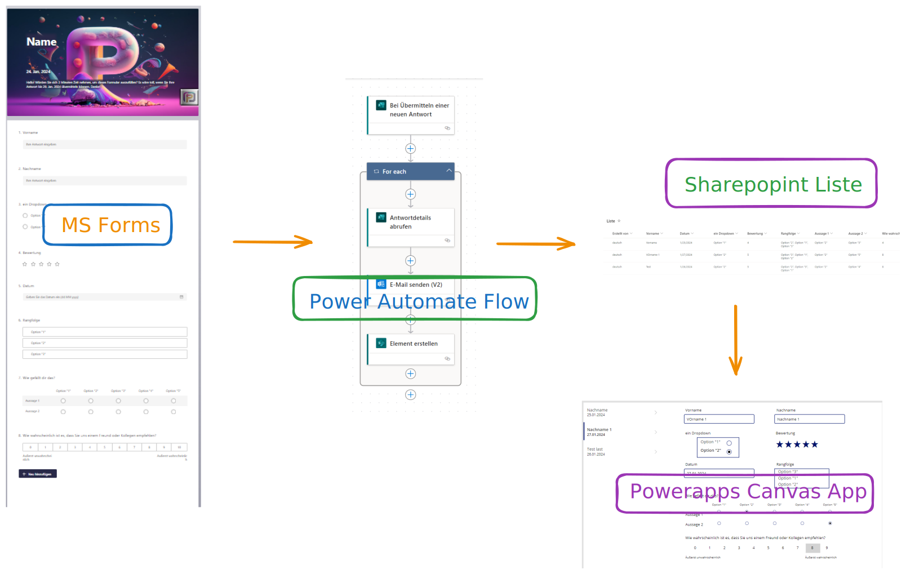
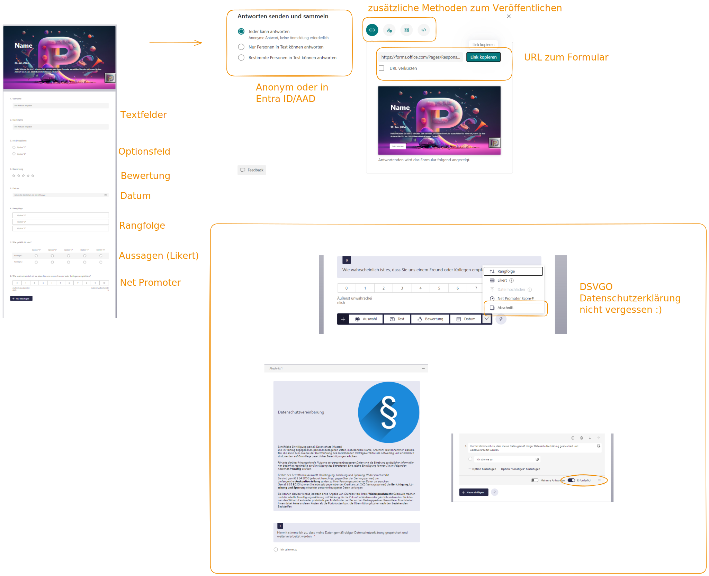
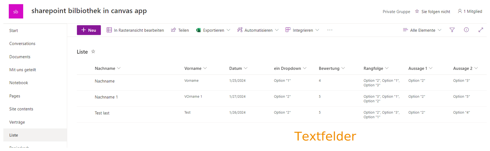
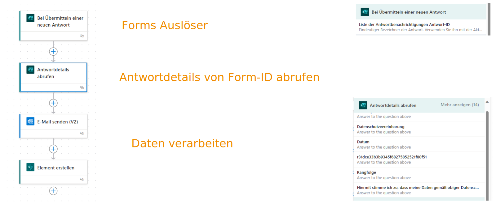
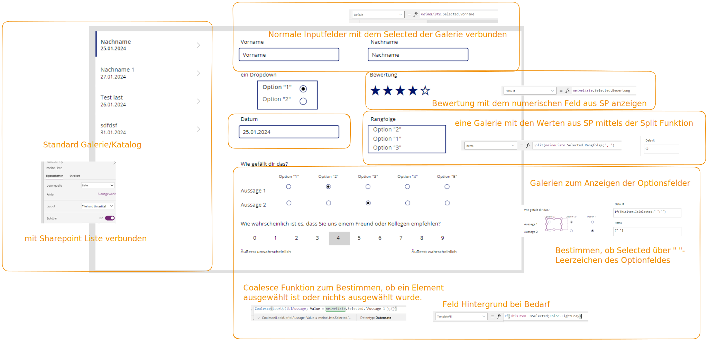

# MS Forms Daten nach Sharepoint mit Powerautomate und in Canvas App anzeigen

## Überblick

Erfassen von Eingaben über MS Forms - auch anonymisiert. Übertragen der MS Form Daten mit einem Power Automate Flow in eine Sharepoint Liste. Anzeigen der Ergebnisse in einer PowerApps Canv as App.

### Referenz und Idee zu diesem Video:

Super Video von [Lisa Crosbie](https://www.youtube.com/@LisaCrosbie) https://www.youtube.com/watch?v=D55WuGz93tA - How to Save Microsoft Forms Responses to Dataverse and Model-Driven Power Apps

## Teil 1 - Formular in MS Forms erstellen

## Teil 2 - Sharepoint Liste erstellen

## Teil 3 - Sammeln der Eingaben in der Sharepoint Liste mit Power Automate

## Teil 4 - Erstellen eines Formulas in einer Canvas App mit demselben Look & Fell wie in MS Forms

* Verwenden eines Form Controls vs direkter Eingabeelemente
* Benutzen von Gallerien zum Anzeigen von Auswahlelementen, Rangfolgen, Aussagen und Net Promoter Score.

